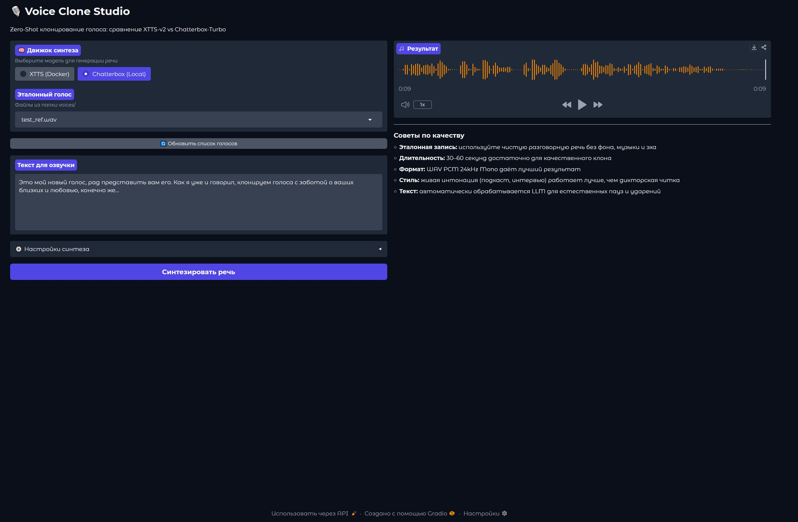

# 🎙️ Voice Clone Studio

Локальная система клонирования голоса и синтеза речи (Zero-Shot TTS) на базе XTTS-v2.  
Работает полностью офлайн на потребительском железе (NVIDIA RTX 3060 12GB + Ollama).


## 🆕 Dual Engine Architecture (XTTS-v2 + Chatterbox V3)

Проект поддерживает два движка синтеза речи с автоматическим переключением через UI:

| Функция | XTTS-v2 (Docker) | Chatterbox V3 (Local) |
| :--- | :--- | :--- |
| **Лицензия** | CPML (ограничения) | ✅ MIT (свободное использование) |
| **Языки** | Мультиязычный | ✅ 23 языка (V3 Multilingual) |
| **Клонирование** | Zero-shot | ✅ Zero-shot + Emotion Control |
| **Запуск** | Требует Docker | ✅ Локально на GPU/CPU |
| **Скорость** | Быстрая (API) | Средняя (0.5B параметров) |

### 🔧 Технические особенности интеграции Chatterbox
- **Monkey-patch watermarker:** Решена проблема `TypeError` модуля `perth` на Windows через заглушку `FakePerth`.
- **Мультиязычность:** Используется класс `ChatterboxMultilingualTTS` с явным указанием `language_id="ru"` для корректной русской фонетики.
- **Управление акцентом:** Параметр `cfg_scale=0.0` отключает наследование стиля эталона при кросс-языковом клонировании.
- **CUDA 12.4:** Принудительная установка `torch==2.6.0+cu124` для совместимости с требованиями библиотеки.

### 🚀 Локальный запуск Chatterbox

## ✨ Особенности

- **Zero-Shot клонирование** — достаточно 30–60 секунд чистой речи для клона
- **LLM-предобработка текста** — Qwen2.5 расставляет паузы, ударения и интонации для естественного звучания
- **Умная склейка сегментов** — бесшовная стыковка по тихим участкам, без щелчков
- **WebUI на Gradio** — выбор голоса, настройка скорости/температуры, мгновенное прослушивание
- **Полностью локально** — никакие данные не покидают вашу машину
- **Docker-инфраструктура** — воспроизводимое окружение, никаких танцев с зависимостями

## 🏗️ Архитектура
┌─────────────┐ HTTP API ┌──────────────────┐
│ Gradio UI │ ◄────────────────► │ XTTS-v2 Server │
│ (app.py) │ │ (Docker + GPU) │
└──────┬──────┘ └──────────────────┘
│
▼
┌─────────────────┐ Ollama API ┌─────────────────┐
│ TTS Engine │ ◄──────────────► │ Qwen2.5-14B │
│ (tts_engine.py) │ │ (Текст → prosody)│
└─────────────────┘ └─────────────────┘

## 🚀 Быстрый старт

### Требования
- NVIDIA GPU с 12GB+ VRAM (RTX 3060/3070/4060+)
- Docker Desktop + WSL2
- Python 3.11+
- Ollama с загруженной моделью `qwen2.5:14b`

### Установка

```bash
# 1. Клонируйте репозиторий
git clone https://github.com/metalltrade1987-star/voice-clone-studio.git
cd voice-clone-studio

# 2. Запустите TTS-сервер
docker compose up -d

# 3. Установите Python-зависимости
pip install -r requirements.txt

# 4. Загрузите модель для предобработки
ollama pull qwen2.5:14b

# 5. Запустите WebUI
python app.py

Откройте http://localhost:7860 в браузере.

📁 Структура проекта
voice-clone-studio/
├── app.py                 # Gradio WebUI
├── main.py                # CLI-точка входа
├── config.yaml            # Настройки TTS и аудио
├── docker-compose.yml     # Инфраструктура XTTS-v2
├── requirements.txt       # Python-зависимости
├── ARCHITECTURE.md         # Спецификация для AI-ассистентов
├── voices/                # Эталонные записи (WAV, 30-60 сек)
└── src/
    ├── tts_engine.py       # HTTP-клиент XTTS + склейка
    ├── text_preprocessor.py # LLM-предобработка текста
    ├── audio_utils.py      # Кроссфейд, нормализация, humanize
    ├── config.py           # Загрузка конфигурации
    └── __init__.py

💡 Советы по качеству
Параметр
Рекомендация
Эталонная запись
Чистая разговорная речь, без музыки/шума/эха
Длительность
30–60 секунд оптимально
Формат
WAV PCM 24kHz Mono
Скорость
0.85–0.9 для естественного темпа
Температура
0.65–0.75 (ниже = стабильнее, выше = вариативнее)
🛠️ Технологический стек
TTS: XTTS-v2 (Coqui AI) via Docker
LLM: Qwen2.5-14B-Instruct via Ollama
UI: Gradio 6.x
Аудио: librosa, soundfile, numpy, scipy
Инфраструктура: Docker Compose, NVIDIA Container Toolkit
📋 Roadmap
Наложение речи на музыку (ducking, sidechain)
Управление базой голосов через WebUI
Пакетная обработка длинных текстов
Fine-tuning (LoRA) для специфических голосов
License
MIT
